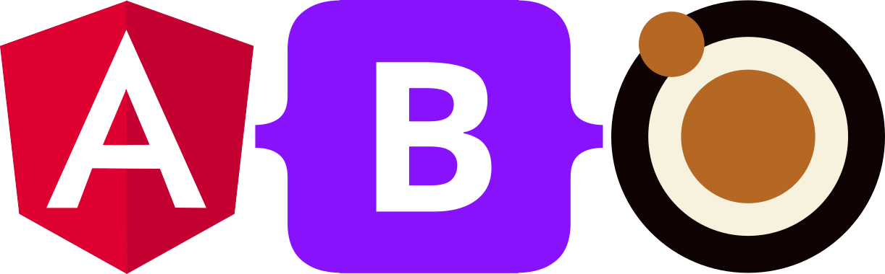

# Angular Bootstrap
[](https://angular.io/) [](https://getbootstrap.com/) [](https://nodejs.org/en/about/releases/)


Versión 01.08.2021

Documento léeme

------

Copyright (C) 2021.

- Sergio Ridaura, sergrida
   https://sergioridaura.com - [info@sergioridaura.com](mailto:info@sergioridaura.com)
- Héctor Orlando, hcrispens
   [hector.or.cr@gmail.com](mailto:hector.or.cr@gmail.com)

------



------


## Tabla de contenido

[TOC]

## Descripción

Proyecto de Angular con la incoporación de Bootstrap como framework de css como también de un conjunto de componentes moleculares (según la metodología de Atom Design).

- Angular es un framework para el diseño de aplicaciones y una plataforma de desarrollo para crear aplicaciones de una sola página eficientes y sofisticadas. 

- Bootstrap es un kit de herramientas de front-end de código abierto , con un sistema de grillas responsivo, amplios componentes prediseñados y potentes complementos de JavaScript. 
- Atom Design es una metodología para el diseño de páginas como un sistema compuesto de partes, las cuales se estructuran en distintos niveles. hay cinco niveles distintos en el atom design:
  - Átomos
  - Moléculas
  - Organismos
  - Plantillas
  - Páginas 

------


## Requirimientos

Para tener instalado el proyecto de angular para el desarrollo de aplicaciones, previamente debe estar instalado en el sistema **Node** y **NPM**, en especial la versión 14 (Fermium) de Node (el software de Node ya incluye el manejador de paquetes NPM).

> El software de node se puede descargar de la pagina oficial [aquí](https://nodejs.org/es/)


También se recomienda instalar el @Angular/Cli que esta la interface de linea de comandos de **Angular**, la misma incluye un conjunto de comandos que facilitan la creación de componentes, módulos, servicios como también la correspondiente compilación del proyecto para la puesta en producción.

> Una vez instalado **Node**  se instala ejecutando en una terminal
>
> ```sh
> npm install -g @angular/cli 
> ```
>
> 

------


## Instalación y primeros pasos

Una vez instalados la versión de node como también angular/cli proceder a clonar este repositorio.

> 
>
> ```bash
> git clone https://github.com/hectorcrispens/anglBtrp
> ```
>
> 

Y posteriormente levantar el servidor web

> 
>
> ```bash
> ng serve
> ```
>
> 

para visualizar el contenido de la aplicación abrir un navegador web en la direccion [http://localhost:4200](http://localhost:4200)

------


## Instalación con contenedores docker

Puede consultar el proyecto **dockMspa** que puede acceder desde [aqui](https://github.com/sergrida/dockMspa), el cual provee un contenedor de docker preparado para trabajar con esta aplicación, además de proveer herramientas para trabajar con todo el stack. Por el contrario si solo va a trabajar con esta aplicación puede descargar de docker hub la imagen [dockAng]() para trabajar solamente con este proyecto de **Angular** descartando asi el resto del stack.

------


## Otros comandos 

El comando **ng** instalado con angular/cli tiene multiples funciones, a continuación se detallan dos argumentos utiles para la construcción de una aplicación en angular, el argumento **generate** y el argumento **build**

**ng generate**

> El comando ng generate permite generar diferentes archivos, según un proposito, a continuación se detallan todos los argumentos que puede tomar el subcomando <schematic>, para mas detalle consulte [aqui](https://angular.io/cli/generate#ng-generate)

```bash
ng generate <schematic> [options]
```

<schematic>

- app-shell
- application
- class
- component
- directive
- enum
- guard
- interceptor
- interface
- library
- module
- pipe
- resolver
- service
- service-worker
- web-worker


**ng build**

> El comando ng build permite compilar la aplicación para que la misma pueda ser deployada a través de cualquier servidor web, despues de utilizar el comando ng build se creará una carpeta llamada */dist* en la cual se encontrará un documento *index.html* con sus correspondientes *css* y *js* .
>
> Puede obtener más informacion del subcomando build [aquí](https://angular.io/cli/build)

```bash
ng build <project> [options]
```

------

